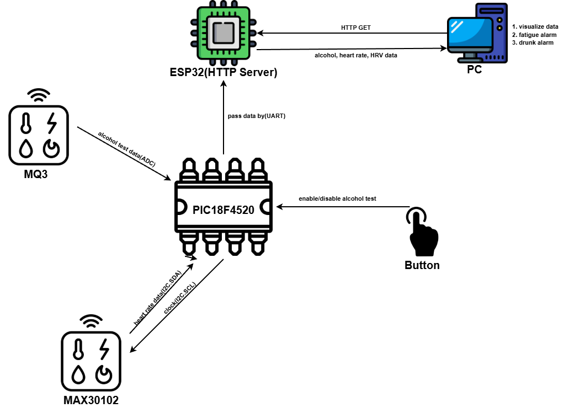

# mcu_final
PIC18F4520 + MAX30102 (PPG) + MQ-3 (alcohol) + ESP32 (Wi-Fi/HTTP).
Real-time heart rate & HRV (fatigue proxy), on-demand alcohol readout, JSON over HTTP.
For education/demo only — not a medical or safety device.

## Features
* Heart rate from PPG (MAX30102), peak detection.
* HRV (RMSSD) on device (short-term estimate of fatigue).
* Alcohol (MQ-3) ADC readout.
* Wi-Fi HTTP API (ESP32) returns JSON for dashboards/logging.
* Simple, hackable code; PC can also compute/plot if preferred. 
    * See [Safe_driver_monitor](https://github.com/Mason1217/Safe_driver_monitor/tree/227d2d8036bb9c5a0dbd20d4e116e7e54c521056).

## System Archotecture


## Demo
* [Video TODO](https://www.youtube.com/watch?v=f6lDWt4uqEs&t=46s)

## Hardware
### Bill of Materials
| Item           | Model            | Notes                                               |
| -------------- | ---------------- | --------------------------------------------------- |
| MCU            | **PIC18F4520**   | I2C master, ADC, UART to ESP32                      |
| PPG            | **MAX30102**     | I2C slave                                           |
| Alcohol        | **MQ-3**         | Analog out → PIC AN0                                |
| Wi-Fi          | **ESP32 DevKit** | Web server + bridge; UART2 RX/TX                    |
| Power          | 5V supply        | Common ground for all boards                        |
### Pinout / Wiring

* PIC18F4520

    * I2C: RC3=SCL, RC4=SDA (enable SSP/I2C, 100–400 kHz)

    * ADC: AN0 ← MQ-3 analog output

    * UART: TX → ESP32 RX0

    * Common GND with sensors

* ESP32 (Arduino core)

    * UART0: RX0, TX0 (to PC for debug)

    * Wi-Fi STA mode; HTTP on port 80

## Repository Layout
```bash
mcu_final/
├─ pic.X/          # MPLAB X + XC8 project for PIC18F4520
├─ esp32/          # PlatformIO (Arduino) project for ESP32
├─ docs/           # Project Descriptions in detail
└─ images/         # images to display in this repo
```

## Clone (with submodules)
```bash
git clone --recurse-submodules <THIS-REPO-URL>
git submodule update --init --recursive
```

## Reminders
### PIC → ESP32 UART format
```
<IR>,<AC>\n
23456,120\n
...
```
### ESP32 (PlatformIO, Arduino core)
In src/main.cpp
```c
const char* SSID  = "your_ssid";        // @TODO: WiFi's name
const char* PASS  = "your_pass";        // @TODO: WiFi's password
const char* PC_IP = "ip_addr";          // @TODO: PC's IPv4
```

## Run & Test
You can reboot the ESP32 devkit, to see the initial information(include its IP address).
```bash
curl http://<ESP32_IP>/test
# → {"AC":123,"HR":72,"HRV":38.5}
```

## Safety & Disclaimer
This project is for coursework and prototyping. Do not rely on it to assess medical conditions or legal fitness to drive. Always follow local regulations and best practices.